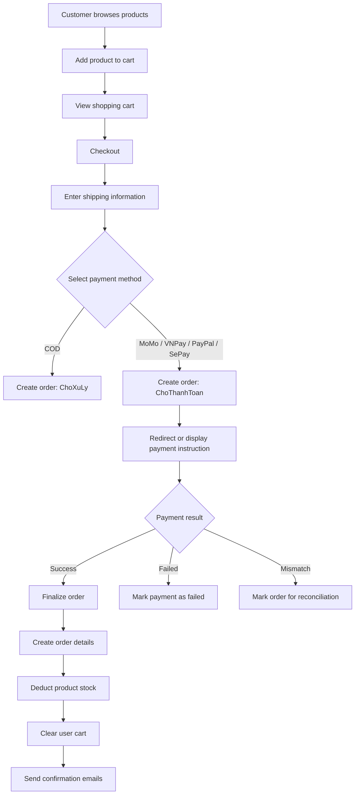
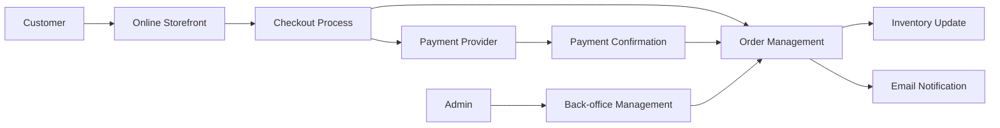
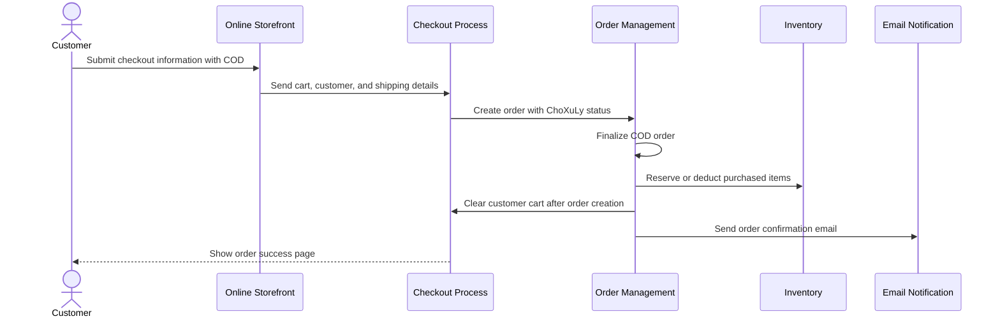
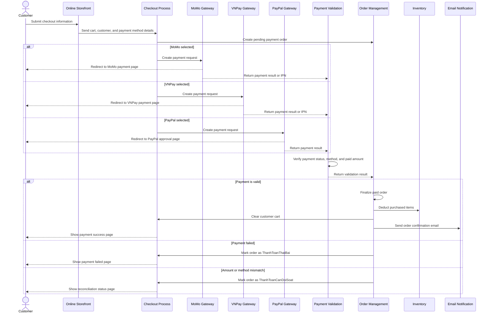
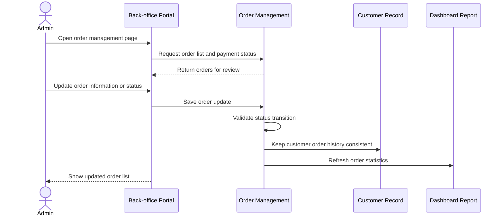
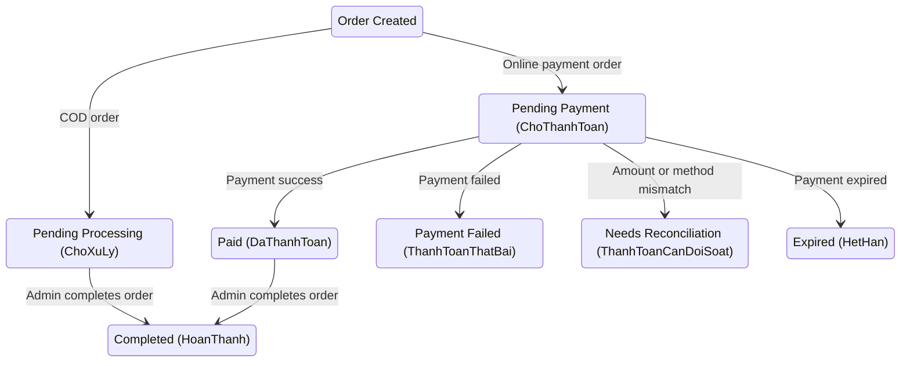
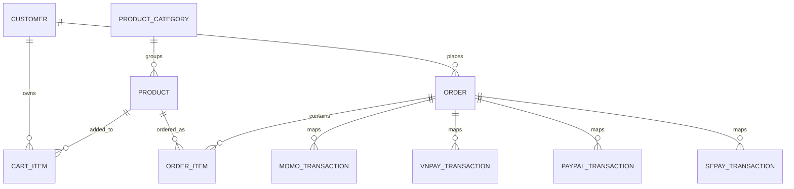

# ReSip - Multi-Payment E-Commerce Website

An ASP.NET Core MVC e-commerce website for eco-friendly products, supporting product browsing, shopping cart, checkout, order management, and multiple payment methods including COD, MoMo, VNPay, PayPal, and SePay.

This project was developed as a real-world e-commerce simulation with a strong focus on business workflow, checkout behavior, payment confirmation, and admin management.

## Project Information

| Item | Details |
|---|---|
| Project Name | ReSip Multi-Payment E-Commerce |
| Role | Technical Team Lead / BA-oriented Developer |
| Timeline | 01/2026 - 04/2026 |
| Location | Ho Chi Minh City, Vietnam |
| Main Domain | E-commerce, Checkout, Payment Integration |
| Repository | https://github.com/ngxuanvan/ReSip-Multi-Payment-E-Commerce |

## My Role

As a Technical Team Lead with a Business Analyst-oriented mindset, I contributed to both business analysis and technical implementation.

- Defined system scope, core modules, functional requirements, and non-functional requirements.
- Designed user flows for product browsing, cart management, checkout, payment, and order history.
- Coordinated implementation across frontend, backend, database, admin, and payment modules.
- Implemented and reviewed core checkout/payment flows using ASP.NET Core MVC and Entity Framework Core.
- Integrated sandbox payment flows for MoMo, VNPay, PayPal, and SePay.
- Tested payment return, IPN, webhook, order status, and transaction logging scenarios.

## Business Context

ReSip is an e-commerce website for selling eco-friendly products such as reusable bottles and straws. The system allows customers to browse products, add items to cart, place orders, and select different payment methods.

The admin side helps the business manage products, categories, orders, users, website settings, blogs, FAQs, and payment transaction records.

## Business Problem

Customers need a simple and reliable checkout process with multiple payment options. The business needs a centralized admin system to manage products, monitor orders, track payment transactions, and support reconciliation when payment data does not match order data.

## Key Features

| Module | Description |
|---|---|
| Product Catalog | Browse products, view product details, filter by category |
| Shopping Cart | Add, update, and remove cart items |
| Checkout | Collect customer information, shipping address, and payment method |
| Multi-Payment | Supports COD, MoMo, VNPay, PayPal, and SePay |
| Order Management | Create orders, track order status, and view order history |
| Payment Confirmation | Handle return, IPN, webhook, and payment validation |
| Admin Dashboard | Manage products, categories, orders, users, blogs, FAQs, and settings |
| Payment Logging | Store transaction records for MoMo, VNPay, PayPal, and SePay |
| Email Notification | Send confirmation emails to customers and admin |

## Stakeholders

| Stakeholder | Goals |
|---|---|
| Customer | Browse products, add to cart, checkout, pay, and track orders |
| Admin | Manage catalog, orders, users, content, and payment transactions |
| Payment Gateway | Process online payments and return payment results |
| System | Validate data, update order status, deduct stock, clear cart, and send email |

## Business Rules

- Users must log in before adding products to cart or placing orders.
- COD orders are created with `ChoXuLy` status.
- Online payment orders are created with `ChoThanhToan` status.
- The system finalizes an online order only after successful payment confirmation.
- Finalizing an order includes creating order details, deducting stock, clearing the cart, and sending confirmation emails.
- If the paid amount does not match the order amount, the order is marked for reconciliation.
- Payment callbacks and webhooks are handled idempotently to reduce duplicate transaction processing.

## Checkout and Payment Flow



## Data Flow Overview



## Business Sequence Diagrams

### COD Checkout Sequence



### Online Payment Sequence



### Admin Order Management Sequence



## Order Status Flow



## Simplified ERD



## Requirement Traceability

| Requirement ID | Business Need | Acceptance Criteria | Status |
|---|---|---|---|
| REQ-01 | Customers can browse products | Customers can view product lists, product details, and category-based product groups | Done |
| REQ-02 | Customers can manage shopping cart items | Customers can add, update, and remove products before checkout | Done |
| REQ-03 | Customers can place orders | Customers can submit shipping information and create an order from cart items | Done |
| REQ-04 | Customers can choose a payment method | Customers can select COD, MoMo, VNPay, PayPal, or SePay during checkout | Done |
| REQ-05 | System can confirm online payments | Successful payments update the order status and trigger order finalization | Done |
| REQ-06 | Business can reconcile payment issues | Amount mismatch, failed payment, and delayed callback cases are tracked for review | Done |
| REQ-07 | Admin can manage business operations | Admin can manage products, orders, users, content, and payment transaction records | Done |
| REQ-08 | System can notify customers | Customers receive order confirmation after successful order creation or payment confirmation | Done |

## Technical Highlights

- Built with ASP.NET Core MVC and Entity Framework Core.
- Designed a complete checkout flow from cart to payment confirmation.
- Integrated multiple payment gateways in sandbox mode.
- Implemented payment return, IPN, and webhook handling.
- Added amount validation before finalizing online payment orders.
- Stored gateway transaction data for payment tracking and reconciliation.
- Used cookie-based authentication for customer and admin access.
- Applied admin area routing for back-office management.
- Used Serilog for application logging.

## Tech Stack

| Layer | Technologies |
|---|---|
| Backend | ASP.NET Core MVC, C# |
| Database | SQL Server, Entity Framework Core |
| Frontend | Razor Views, HTML, CSS, Bootstrap, JavaScript, jQuery |
| Authentication | Cookie Authentication |
| Payment | MoMo, VNPay, PayPal, SePay |
| Email | SMTP / MailKit |
| Logging | Serilog |

## Screenshots

Add the following images later under `docs/screenshots/`.

| Screen | Image File |
|---|---|
| Home Page | `docs/screenshots/01-home-page.png` |
| Product Listing | `docs/screenshots/02-product-listing.png` |
| Product Detail | `docs/screenshots/03-product-detail.png` |
| Shopping Cart | `docs/screenshots/04-shopping-cart.png` |
| Checkout Page | `docs/screenshots/05-checkout-page.png` |
| MoMo Payment | `docs/screenshots/06-momo-payment.png` |
| VNPay Payment | `docs/screenshots/07-vnpay-payment.png` |
| PayPal Payment | `docs/screenshots/08-paypal-payment.png` |
| SePay QR Payment | `docs/screenshots/09-sepay-payment.png` |
| Order Success | `docs/screenshots/10-order-success.png` |
| Admin Dashboard | `docs/screenshots/11-admin-dashboard.png` |
| Admin Order Management | `docs/screenshots/12-admin-orders.png` |
| Admin Product Management | `docs/screenshots/13-admin-products.png` |
| Payment Transaction Management | `docs/screenshots/14-payment-transactions.png` |

### Preview Placeholders


## Folder Structure

```text
ResipWeb/
├── Areas/Admin/              # Admin controllers and views
├── Controllers/              # Customer-facing MVC controllers
├── Models/                   # Entity models and view models
├── Services/                 # Order, email, exchange rate, and payment services
├── Views/                    # Razor views
├── wwwroot/                  # Static assets and uploaded images
├── Migrations/               # EF Core migrations
└── Database/                 # Database backup file
```

## Setup Guide

1. Restore the SQL Server database from `Database/ResipWebDb.bak`.
2. Update the connection string in `appsettings.json`.
3. Configure sandbox credentials for MoMo, VNPay, PayPal, and SePay.
4. Configure email settings for SMTP.
5. Run the project:

```bash
dotnet run
```

## BA Analysis Highlights

- Identified key actors, business goals, and system boundaries.
- Designed user flows for product browsing, cart, checkout, and payment confirmation.
- Defined order status transitions for COD and online payment scenarios.
- Added reconciliation handling for payment amount mismatch cases.
- Designed admin workflows for managing catalog, orders, and transactions.
- Considered real-world payment risks such as duplicate callback, failed payment, and delayed webhook.

## Future Improvements

- Add automated unit and integration tests for checkout and payment flows.
- Improve order status standardization across customer and admin dashboards.
- Add stock validation before checkout confirmation.
- Add advanced search and filtering for admin order management.
- Add customer-facing order tracking by order code.
- Add deployment guide and live demo video.
