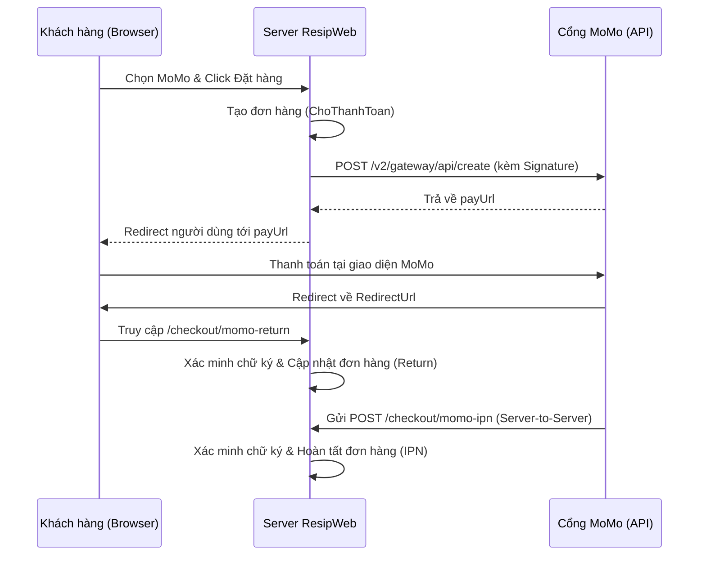

# Tài liệu Đặc tả Luồng Thanh Toán MoMo (API v2)

Tài liệu này hướng dẫn chi tiết cách tích hợp và vận hành cổng thanh toán MoMo trong dự án **ResipWeb** (ASP.NET Core).

---

## 1. Cấu hình hệ thống

Các thông số kết nối được lưu trong `appsettings.json`. Đảm bảo các giá trị `PartnerCode`, `AccessKey`, và `SecretKey` được cung cấp bởi MoMo Sandbox/Production.

```json
"Momo": {
    "Endpoint": "https://test-payment.momo.vn/v2/gateway/api/create",
    "PartnerCode": "MOMO4MUD20240115_TEST",
    "AccessKey": "Ekj9og2VnRfOuIys",
    "SecretKey": "PseUbm2s8QVJEbexsh8H3Jz2qa9tDqoa",
    "RedirectUrl": "https://dotnet.resip.io.vn/checkout/momo-return",
    "IpnUrl": "https://dotnet.resip.io.vn/checkout/momo-ipn"
}
```

---

## 2. Sơ đồ Luồng Thanh toán



---

## 3. Các bước triển khai chi tiết

### Bước 1: Khởi tạo yêu cầu (`CreatePayWithAtmAsync`)
Trong `MomoService.cs`, hệ thống xây dựng chuỗi `rawHash` theo thứ tự alphabet các tham số quan trọng:

> [!IMPORTANT]
> **Thứ tự tham số trong rawHash:**
> `accessKey` & `amount` & `extraData` & `ipnUrl` & `orderId` & `orderInfo` & `partnerCode` & `redirectUrl` & `requestId` & `requestType`

```csharp
var signature = HmacSha256(rawHash, _opt.SecretKey);
// Gửi POST lên MoMo Endpoint
```

### Bước 2: Xử lý Client Return (`MomoReturn`)
Tại Controller, khi khách hàng quay lại web:
1. **Verify**: Kiểm tra chữ ký từ Query String để tránh giả mạo số tiền hoặc trạng thái.
2. **Log**: Lưu kết quả vào bảng `MomoTransactions` (Source: "RETURN").
3. **Action**: Nếu `resultCode == 0`, gọi `OrderService` để chuyển trạng thái đơn hàng sang **Paid**.

### Bước 3: Xử lý IPN - Server Callback (`MomoIpn`)
Đây là bước an toàn nhất vì diễn ra trực tiếp giữa 2 server:
1. **Verify**: Đọc JSON body và kiểm tra chữ ký.
2. **Idempotency**: Dựa vào `TransId` để kiểm tra giao dịch đã được xử lý chưa (tránh cộng tiền/trừ kho 2 lần).
3. **Cập nhật**: Hoàn tất đơn hàng hoặc hủy đơn nếu thanh toán thất bại.

---

## 4. Bảo mật và Độ tin cậy

### Xác minh Chữ ký (Signature Verification)
Dùng thuật toán HMAC-SHA256 với `SecretKey`. Chuỗi băm đầu vào phải được sắp xếp chính xác theo tài liệu MoMo.
```csharp
private static string HmacSha256(string input, string key) {
    // ... logic băm SHA256 ...
}
```

### Xử lý trùng lặp (Idempotency)
MoMo có thể gửi IPN nhiều lần nếu server của bạn không phản hồi `200 OK` kịp thời. Hệ thống sử dụng logic sau:
- Tìm giao dịch theo `TransId`. 
- Nếu đã tồn tại, chỉ cập nhật log.
- Nếu chưa có, mới tiến hành thay đổi trạng thái đơn hàng.

### Tích hợp OrderService
Luồng MoMo được tích hợp sâu với `OrderService` để đảm bảo:
- Đồng bộ tồn kho sản phẩm.
- Tự động gửi email thông báo sau khi thanh toán thành công.
- Ghi lại vết lịch sử trạng thái đơn hàng.

---

> [!TIP]
> Luôn sử dụng môi trường Sandbox của MoMo để kiểm thử các mã lỗi (resultCode) trước khi chuyển sang Production.
